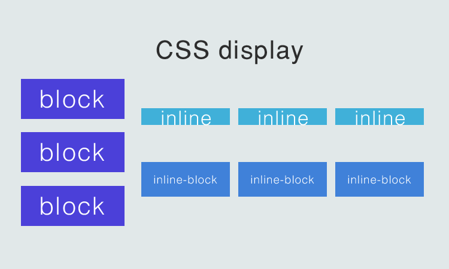

# Elemento Block
ocupa todo o espaço da tela e fica um a baixo do outro.
exemplos: h1, p, table

# Elemento inline
um elementos fica a frente do outro, e a largura do elemento é de acordo 
com seu conteúdo.
exemplos: a, span, img

# Elemento Inline-Block
a largura é definida pelo tamanho do conteúdo mas quando o item não cabe mais na linha ele pula pra proxima.
exemplos: display: inline-block 

